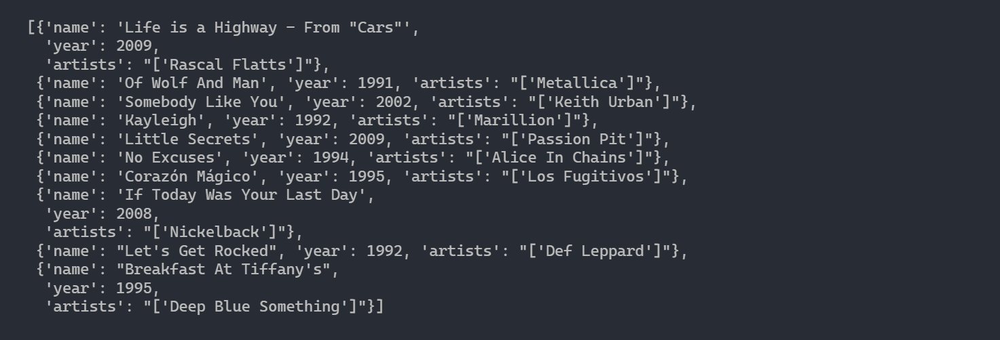
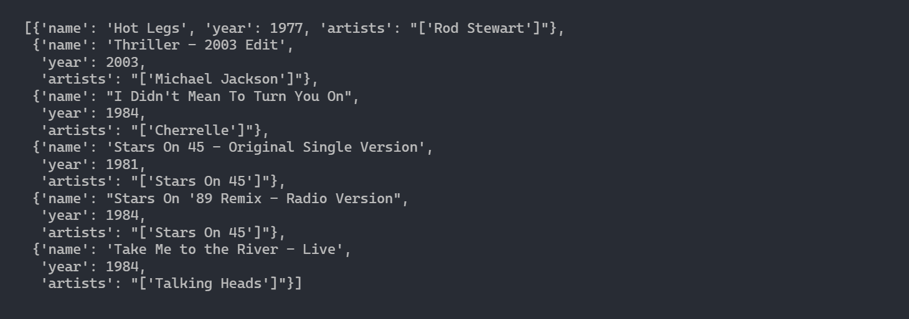

# Content based Spotify Music reccomendation system

This application helps users to get a personalized song suggestions based on their listening history. The user enters set songs which representative of his listening history and the application outputs an array of songs which he/she is likely to enjoy from its database.

 

### Suppose we have entered an array consisting of 1990s grunge from Nirvana

### This is the output of our program

As we can see from the list above, the recommendation algorithm produced a list of rock songs from the 1990s and 2000s. Bands in the list such as Metallica, Alice in Chains, and Nickelback are similar to Nirvana. The top song on the list, “Life is a Highway” is not a grunge song, but the rhythm of the guitar riff actually sounds similar to Nirvana’s “Smells Like Teen Spirit” if you listen closely.

 

### Trying out on Michael Jackson Songs

### This is the output of our program

### Is the recommended list of songs actually correlates to our input list?

The top song on the list is by Rod Stewart, who like Michael Jackson, rose to fame in the 1980s. The list also contains a 2003 edit of Michael Jackson’s Thriller, which makes sense given that the user has already heard the original 1982 version of this song. The list also includes pop and rock songs from 1980s groups such as Stars On 45 and Talking Heads.

 

### You can find the detailed information regarding the working of this application in **main_project.ipynb** file
